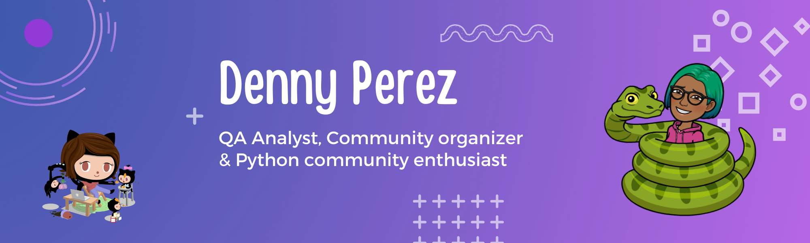

# Hi there. I'm Denny. 👋

I'm a software QA Analyst  who is passionate about building communities and empowering the Spanish speaking community in many countries. Some technologies I enjoy working with include VSCode, Azure Devops, GitHub. My interest in growing communities led me to start participating as an organizer of events such as conferences, Meetups, tech interviews and creating documentation to make these processes easier. Volunteer as coordinator of GitHub-related events in Latin America at GitHub ¡Presente! en Español. If you like to share knowledge with tech  communities, let's talk!!

## Find me around communities:

* [Linktree](https://linktr.ee/Dennyperez18)

## Find me around the web 🌎:

* [Twitter](https://twitter.com/dennyperez18)
* [LinkedIn](https://www.linkedin.com/in/dennyperez18/)
* [Website](https://dennyperez.dev/)
* [Work Email](denny.perez.dev@gmail.com)

## Learn more about my communities:

### La Escuelita de GitHub

Es un proyecto en el que buscamos colaborar en la comunidad hispanohablante a través de material educativo, eventos como workshops, meetups y conferencias, así como también noticias de actualidad alrededor de las comunidades de tecnoligía Git y GitHub.

Estamos abiertos a la colaboración de todas las personas de la comunidad, que esten interesadas en compartir conocimiento en Español de manera voluntaria.
