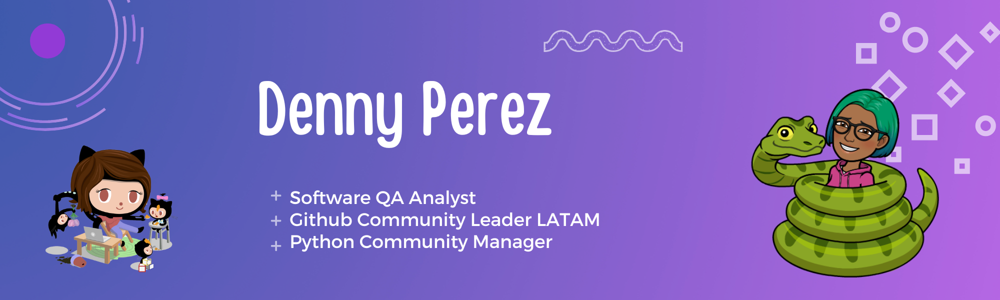

# Hi there. I'm Denny. 👋

I'm a software QA Analyst  who is passionate about building communities and empowering the Spanish speaking community in many countries. Some technologies I enjoy working with include VSCode, Azure Devops, GitHub. My interest in growing communities led me to start participating as an organizer of events such as conferences, Meetups, tech interviews and creating documentation to make these processes easier. Volunteer as coordinator of GitHub-related events in Latin America at GitHub ¡Presente! en Español. If you like to share knowledge with tech  communities, let's talk!!

## Find me around communities:

* [Linktree](https://linktr.ee/Dennyperez18)

## Find me around the web 🌎:

* [Twitter](https://twitter.com/dennyperez18)
* [LinkedIn](https://www.linkedin.com/in/dennyperez18/)
* [Website](https://dennyperez.dev/)
* [Work Email](denny.perez23@gmail.com)

## Projects:

### La Escuelita de GitHub

Es un proyecto en el que buscamos colaborar en la comunidad hispanohablante a través de material educativo, eventos como workshops, meetups y conferencias, así como también noticias de actualidad alrededor de las comunidades de tecnoligía Git y GitHub.

Estamos abiertos a la colaboración de todas las personas de la comunidad, que esten interesadas en compartir conocimiento en Español de manera voluntaria.

 

### PSF Advocacy Focus

Como miembro del Board de Directores de la Python Software Foundation (PSF) desde 2023, estoy comprometida a difundir información valiosa para la comunidad. Este proyecto ofrece un espacio accesible para compartir contenido relevante sobre la PSF, destacando a las personas detrás de su impacto, las comunidades que la integran y los recursos que ofrece. A través de historias inspiradoras y contenido informativo, buscamos fortalecer las conexiones dentro de la comunidad global de Python, promoviendo la colaboración y el acceso a oportunidades que enriquecen el ecosistema de Python.

### Casi Viernes con PyLadies

Casi Viernes con PyLadies es un streaming bi-semanal dedicado a explorar cómo crear y fortalecer comunidades de mujeres en torno al lenguaje de programación Python. Esta iniciativa busca responder todas las dudas sobre cómo comenzar capítulos de PyLadies y los procesos necesarios para mantenerlos activos. Es un espacio para socializar, compartir experiencias y aprender más sobre la comunidad global de PyLadies. ¡Te invitamos a unirte y compartir experiencias en esta comunidad!

### Women Techmakers Using Python & GitHub

Como Women Techmakers Ambassador, lancé esta iniciativa para crear espacios donde mujeres del ámbito tecnológico, especialmente de las comunidades de Python y GitHub, puedan compartir sus conocimientos. A través de eventos y actividades, promovemos el aprendizaje, la colaboración y la visibilidad de mujeres en la tecnología, inspirando a más personas a unirse y crecer en estas comunidades. Si deseas participar compartiendo conocimientos, completa este formulario.
